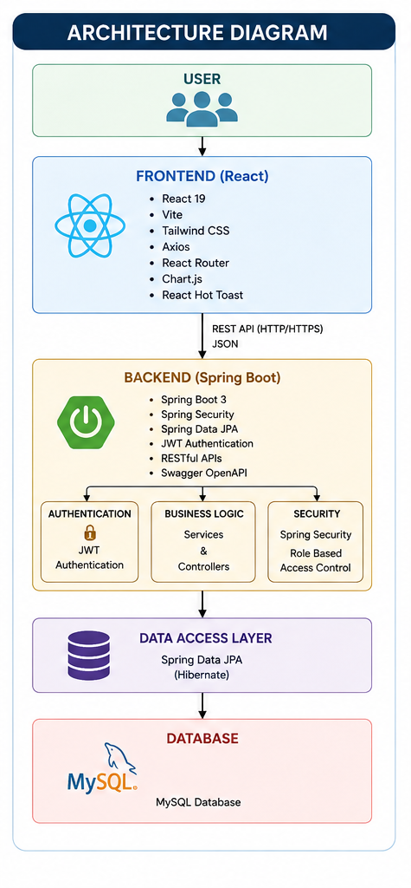
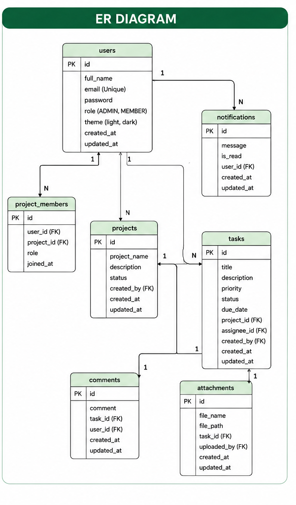
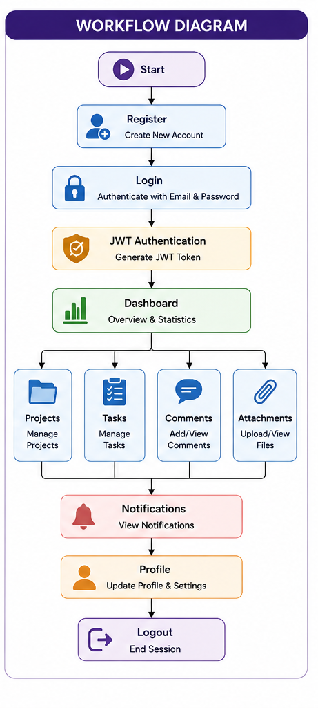
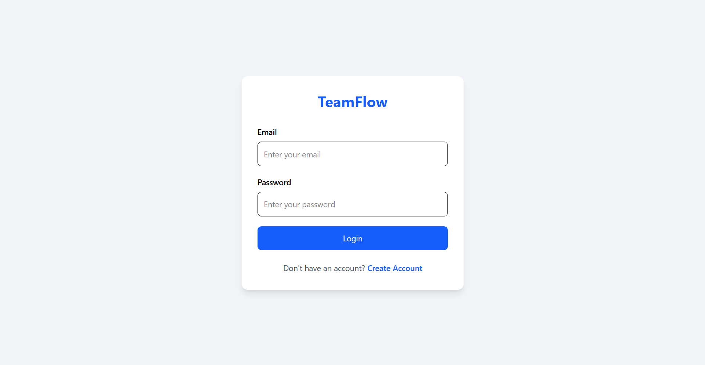
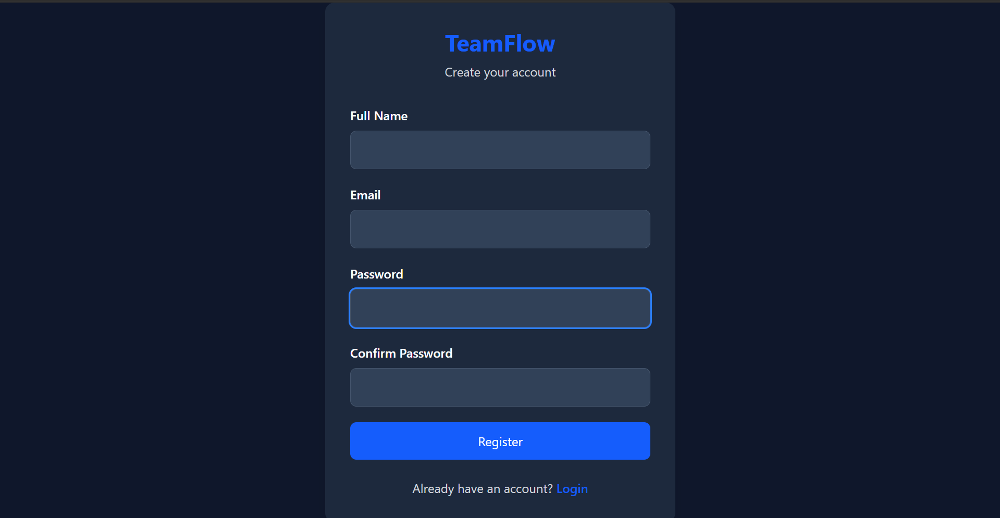
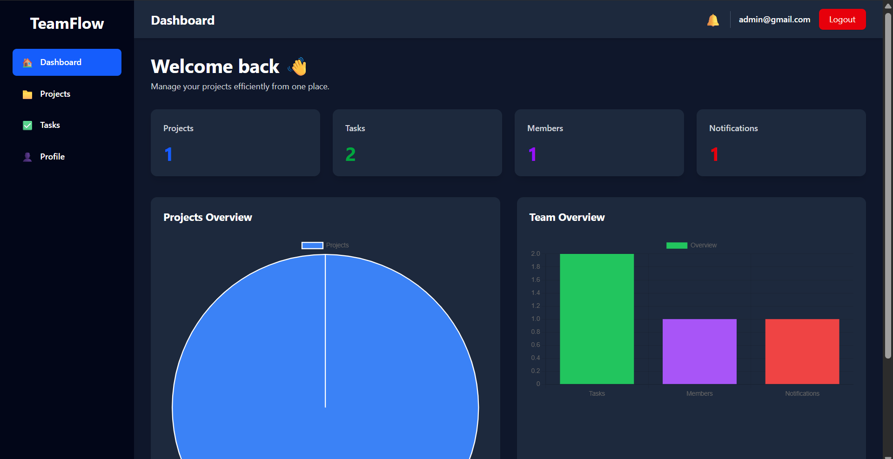
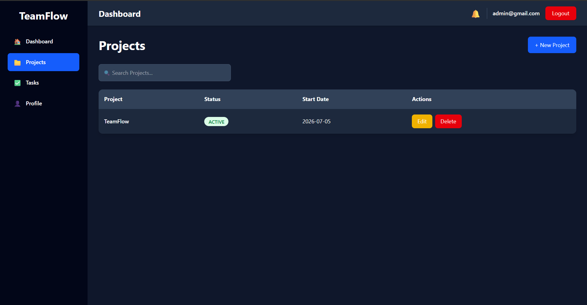
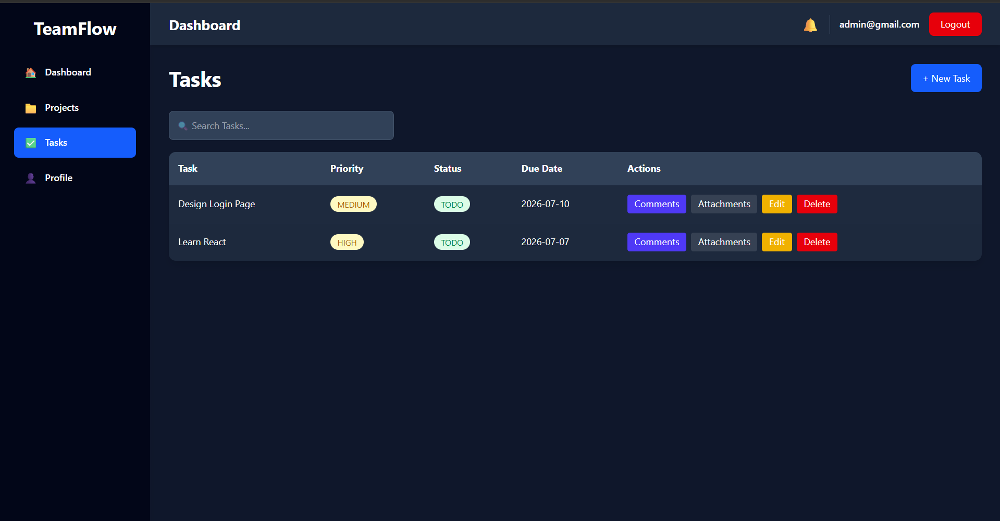
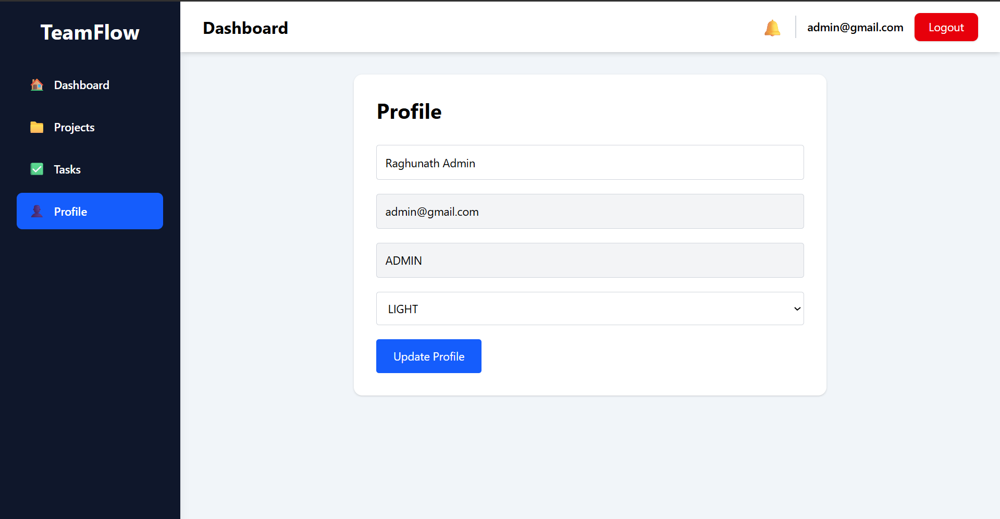
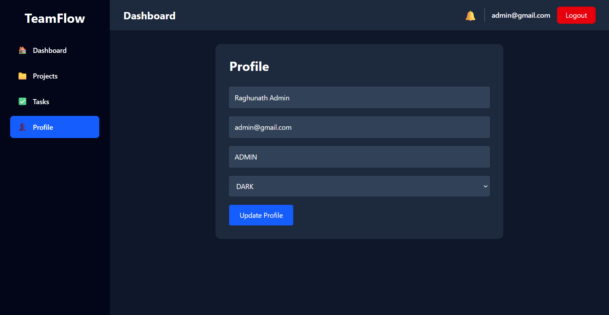

# 🚀 TeamFlow

A modern **Full Stack Project Management and Team Collaboration System** built using **Spring Boot**, **React**, and **MySQL**. TeamFlow helps teams efficiently manage projects, tasks, comments, attachments, notifications, and user profiles through a secure and responsive web application.

---

## ✨ Features

### 🔐 Authentication
- User Registration
- Secure Login using JWT Authentication
- Role-Based Access Control (Admin & Member)
- Logout Functionality

### 📊 Dashboard
- Project Statistics
- Task Statistics
- Team Member Count
- Notifications Summary
- Interactive Charts

### 📁 Project Management
- Create Project
- Update Project
- Delete Project
- Search Projects
- Track Project Status

### ✅ Task Management
- Create Task
- Update Task
- Delete Task
- Assign Tasks
- Set Priority
- Due Date Management
- Search Tasks

### 💬 Comments
- Add Comments
- View Comments
- Delete Comments

### 📎 Attachments
- Add Attachments
- View Attachments
- Delete Attachments

### 🔔 Notifications
- Notification System
- Notification Counter
- User Notification Panel

### 👤 User Profile
- Update Profile
- Theme Selection
- View User Information

### 🌙 UI Features
- Dark Mode
- Light Mode
- Responsive Design
- Loading Spinners
- Toast Notifications

---

# 🛠 Tech Stack

## Backend

- Java 21
- Spring Boot 3
- Spring Security
- Spring Data JPA
- Hibernate
- JWT Authentication
- MySQL
- Maven
- Swagger OpenAPI

## Frontend

- React 19
- Vite
- Tailwind CSS
- Axios
- React Router
- Chart.js
- React Hot Toast

## Database

- MySQL

---

# 🏗 Architecture

```
React Frontend
       │
       │ REST API
       ▼
Spring Boot Backend
       │
       ▼
Spring Security + JWT
       │
       ▼
MySQL Database
```

---

# 📂 Project Structure

```text
TeamFlow
│
├── backend
├── frontend
├── database
│   ├── schema.sql
│   └── migrations
├── demo
├── diagrams
├── docs
└── README.md
```

---

# 🚀 Key Features

- JWT Authentication
- RESTful APIs
- CRUD Operations
- Dashboard Analytics
- Responsive UI
- Dark Mode
- Charts & Statistics
- Team Collaboration
- Clean Architecture
- Secure APIs

---

# 📸 Screenshots

Screenshots are available inside the **demo/** folder.

- Login
- Register
- Dashboard
- Projects
- Tasks
- Profile
- Dark Mode

---

# 👨‍💻 Author

**Raghunath Toparam**

GitHub:
https://github.com/Raghunath09

---

# ⚙️ Installation Guide

## Prerequisites

Before running this project, make sure you have installed:

- Java 21
- Maven
- MySQL 8+
- Node.js 18+
- npm
- Git

---

## Clone Repository

```bash
git clone https://github.com/Raghunath09/TeamFlow.git

cd TeamFlow
```

---

## Backend Setup

```bash
cd backend
```

Configure your MySQL database inside:

```
src/main/resources/application.properties
```

Example:

```properties
spring.datasource.url=jdbc:mysql://localhost:3306/teamflow
spring.datasource.username=root
spring.datasource.password=your_password
```

Run the backend:

```bash
mvn spring-boot:run
```

Backend runs on:

```
http://localhost:8080
```

Swagger UI:

```
http://localhost:8080/swagger-ui/index.html
```

---

## Frontend Setup

```bash
cd frontend

npm install

npm run dev
```

Frontend runs on:

```
http://localhost:5173
```

---

# 🔑 API Modules

The backend exposes REST APIs for:

- Authentication
- Users
- Dashboard
- Projects
- Tasks
- Comments
- Attachments
- Notifications

API documentation is available through Swagger.

---

# 🔒 Security

TeamFlow uses:

- JWT Authentication
- Spring Security
- Password Encryption
- Protected REST APIs
- Role-Based Authorization

---

# 👥 Demo Credentials

## Admin

Email: admin@gmail.com

Password: root123

## Member

Email: testuser@gmail.com

Password: root123

# 📈 Future Enhancements

Some ideas for future versions:

- Email Notifications
- File Upload to Cloud Storage
- Team Chat
- Calendar Integration
- Activity Timeline
- Task Labels
- Project Reports (PDF)
- Kanban Board
- Drag & Drop Tasks
- Mobile Application

---

# 🧪 Testing

The following modules have been tested:

- User Registration
- User Login
- Dashboard
- Project CRUD
- Task CRUD
- Comments
- Attachments
- Notifications
- Profile Update
- Theme Switching
- Responsive Layout

---

# 🤝 Contributing

Contributions are welcome.

If you'd like to improve TeamFlow:

1. Fork the repository.
2. Create a feature branch.
3. Commit your changes.
4. Open a Pull Request.

---

# 📜 License

This project is developed for educational and portfolio purposes.

---

# ⭐ Support

If you found this project useful:

- ⭐ Star this repository
- 🍴 Fork it
- 📢 Share it with others

---

# 🙏 Acknowledgements

Special thanks to:

- Spring Boot
- React
- Tailwind CSS
- MySQL
- Chart.js
- Vite
- Swagger OpenAPI

for providing the amazing open-source technologies used in this project.

---

# 🏗 System Architecture

The following diagram illustrates the high-level architecture of TeamFlow.

<p align="center">
  
</p>

---

# 🗄 Entity Relationship Diagram

The ER Diagram represents the relationship between the database entities used in TeamFlow.

<p align="center">
  
</p>

---

# 🔄 Application Workflow

The workflow below demonstrates the user journey from authentication to project and task management.

<p align="center">
  
</p>

---

# 📷 Application Screenshots

## Login

<p align="center">
  
</p>

---

## Register

<p align="center">
  
</p>

---

## Dashboard

<p align="center">
  
</p>

---

## Projects

<p align="center">
  
</p>

---

## Tasks

<p align="center">
  
</p>

---

## Profile

<p align="center">
  
</p>

---

## Dark Mode

<p align="center">
  
</p>